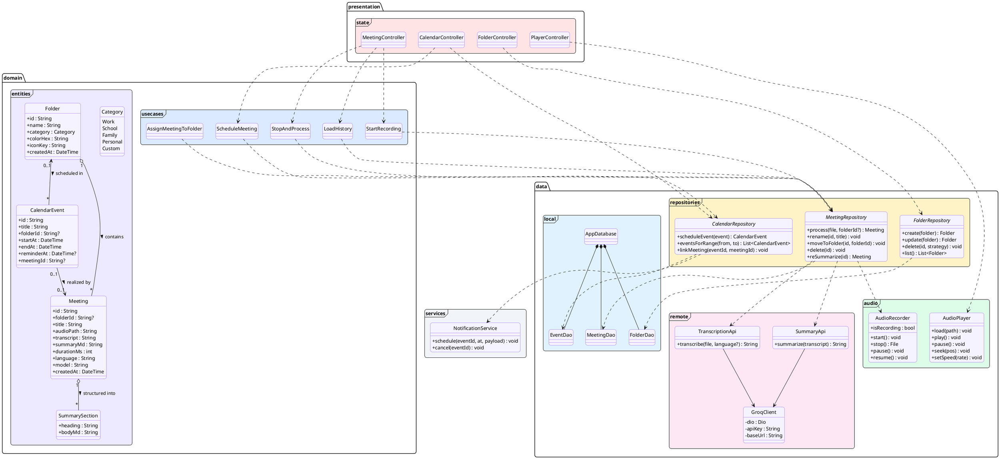
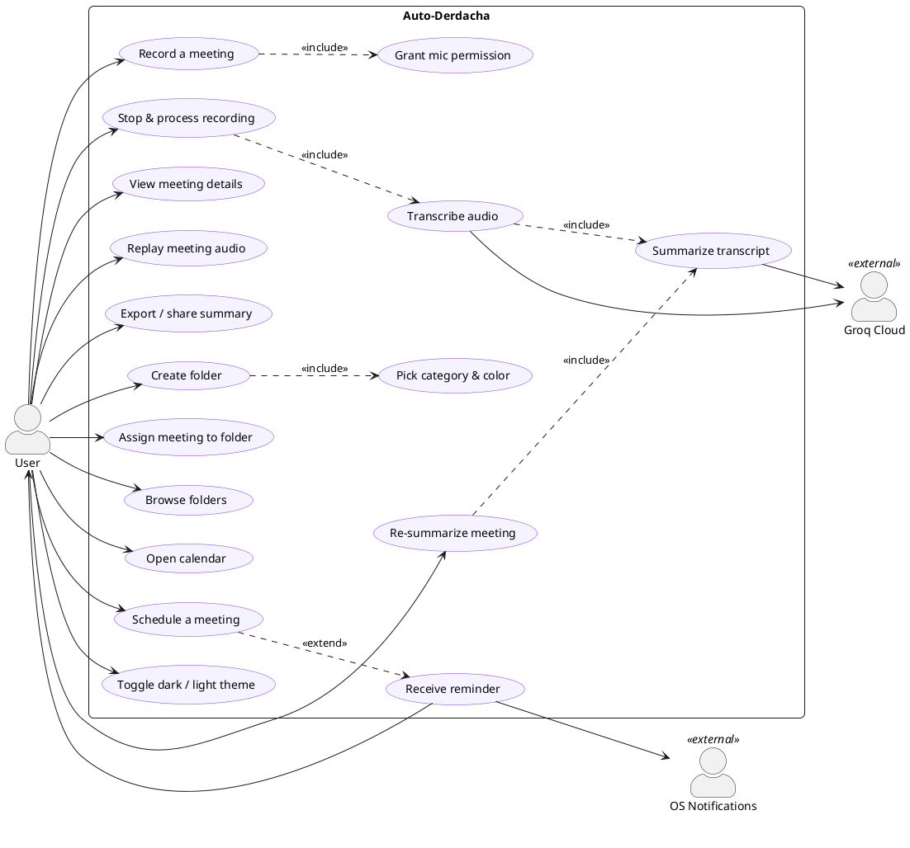
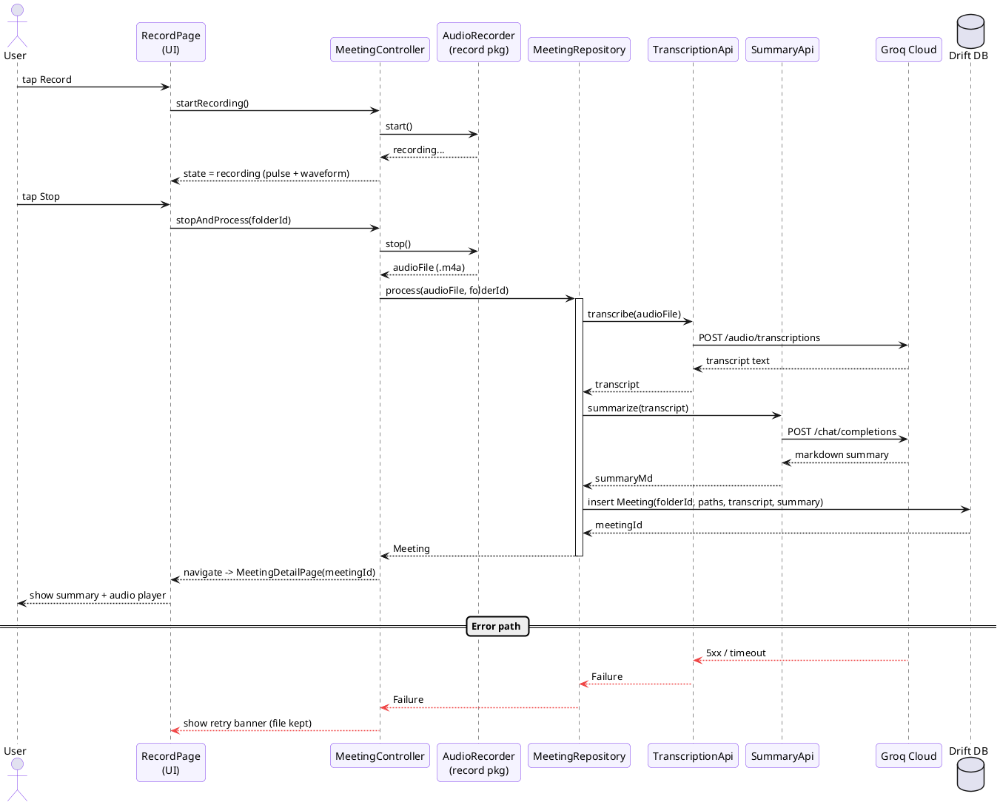
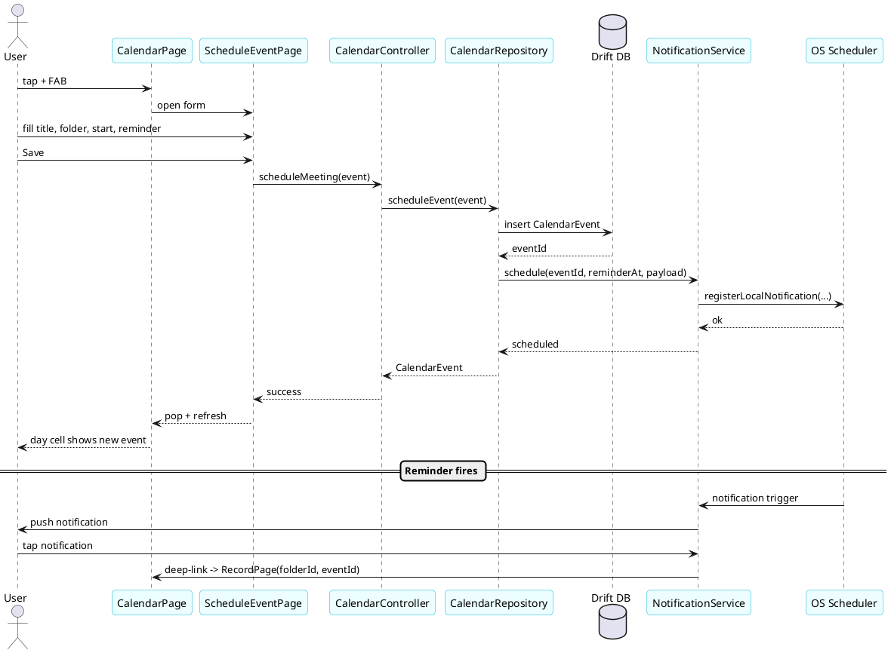
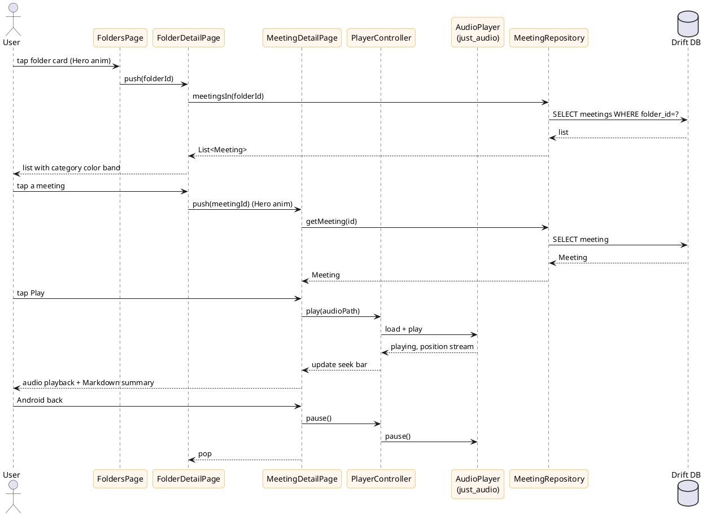

# Auto-Derdacha — UML Diagrams (PlantUML)

Three diagrams derived from `architecture.md`:

1. **Class diagram** — domain entities, repositories, APIs, controllers.
2. **Use-case diagram** — actor goals.
3. **Sequence diagrams** — (a) record → transcribe → summarize, (b) schedule meeting + reminder, (c) replay meeting from a folder.

---

## 1. Class diagram

---

## 2. Use-case diagram

---

## 3a. Sequence — Record → Transcribe → Summarize

---

## 3b. Sequence — Schedule a meeting + reminder

---

## 3c. Sequence — Open a folder & replay a meeting

---
