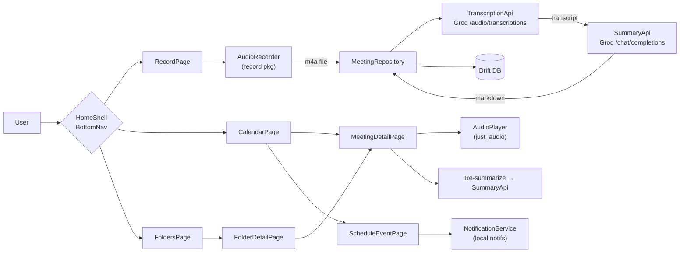

# Auto-Derdacha — Architecture

> Flutter app that records multilingual meetings (Darija / French / English), uploads the audio to Groq's free Whisper endpoint, renders a structured Markdown summary, and organizes everything in user-managed folders + a calendar view.

---

## 1. High-level overview

Auto-Derdacha is a **single Flutter client** with **no custom backend**. Two HTTP calls to Groq drive the pipeline:

1. `POST /openai/v1/audio/transcriptions` (`whisper-large-v3`) → raw multilingual transcript.
2. `POST /openai/v1/chat/completions` (`llama-3.3-70b-versatile`) → structured Markdown summary, with a system prompt that handles Darija and FR/EN code-switching.

Operating mode: **record-then-upload** (the user records the full meeting, then sends it once on stop). No live streaming in v1.

Around the recording pipeline, the app provides three organizational surfaces:

- **Calendar** — meetings plotted by date; tap a day to see/add meetings; schedule upcoming meetings with reminders.
- **Folders & categories** — users create folders (e.g. *Work*, *School*, *Family*), assign a category + color + icon to each, and file meetings into them.
- **Meeting detail** — every meeting has a rich page showing metadata, the Markdown summary, the raw transcript, and an **in-app audio replay** of the original recording.

---

## 2. Layered structure (Clean-ish architecture)

```
lib/
├── main.dart
├── app.dart                       # MaterialApp, router, theme (see §9)
├── core/
│   ├── config/
│   │   └── env.dart               # Groq base URL, model IDs (key via --dart-define)
│   ├── errors/failures.dart
│   ├── theme/
│   │   ├── app_theme.dart         # ColorScheme.fromSeed, Material 3, dark/light
│   │   ├── app_colors.dart        # brand palette + category color tokens
│   │   └── app_typography.dart    # Google Fonts (Inter / Cairo for Arabic)
│   ├── router/app_router.dart     # go_router routes
│   └── utils/file_utils.dart
├── data/
│   ├── audio/
│   │   ├── audio_recorder.dart    # wraps `record`: start/stop/pause, returns File
│   │   ├── audio_player.dart      # wraps `just_audio` for replay
│   │   └── recording_state.dart
│   ├── remote/
│   │   ├── groq_client.dart       # Dio client + auth header
│   │   ├── transcription_api.dart # multipart upload to /audio/transcriptions
│   │   └── summary_api.dart       # chat/completions call with prompt
│   ├── local/
│   │   ├── app_database.dart      # Drift / sqflite schema
│   │   ├── meeting_dao.dart
│   │   ├── folder_dao.dart
│   │   └── event_dao.dart         # calendar events / scheduled meetings
│   └── repositories/
│       ├── meeting_repository.dart# orchestrates record → transcribe → summarize → save
│       ├── folder_repository.dart # CRUD folders + categories
│       └── calendar_repository.dart
├── domain/
│   ├── entities/
│   │   ├── meeting.dart           # id, folderId, audioPath, transcript, summaryMd, durationMs, createdAt
│   │   ├── folder.dart            # id, name, category, colorHex, iconKey
│   │   ├── category.dart          # enum-like: Work, School, Family, Personal, Custom
│   │   ├── calendar_event.dart    # id, title, start, end, meetingId?, reminderAt?
│   │   └── summary_section.dart
│   └── usecases/
│       ├── start_recording.dart
│       ├── stop_and_process.dart  # the main pipeline use-case
│       ├── assign_meeting_to_folder.dart
│       ├── schedule_meeting.dart  # creates calendar_event + optional notification
│       └── load_history.dart
├── presentation/
│   ├── pages/
│   │   ├── home_shell.dart        # bottom nav: Record · Calendar · Folders · Settings
│   │   ├── record_page.dart       # big record button, timer, live waveform
│   │   ├── processing_page.dart   # uploading / transcribing / summarizing
│   │   ├── calendar_page.dart     # month/week view, day drawer with meetings + scheduled events
│   │   ├── schedule_event_page.dart
│   │   ├── folders_page.dart      # grid of folder cards (color + icon + count)
│   │   ├── folder_detail_page.dart# list of meetings inside a folder
│   │   ├── meeting_detail_page.dart
│   │   │     # ── metadata, summary (flutter_markdown), transcript tab,
│   │   │     #    audio player with seek bar (replay original recording)
│   │   ├── new_folder_page.dart
│   │   └── settings_page.dart
│   ├── widgets/
│   │   ├── record_button.dart
│   │   ├── waveform_indicator.dart
│   │   ├── audio_player_bar.dart  # play/pause, seek, speed (1x/1.5x/2x)
│   │   ├── folder_card.dart       # gradient + icon + meeting count
│   │   ├── category_chip.dart
│   │   └── calendar_day_cell.dart # dot indicators per category color
│   └── state/                     # Riverpod notifiers
│       ├── meeting_controller.dart
│       ├── folder_controller.dart
│       ├── calendar_controller.dart
│       └── player_controller.dart
└── services/
    └── notification_service.dart  # flutter_local_notifications for reminders
```

**Dependency direction:** `presentation` → `domain` → `data`. `domain` is pure Dart.

---

## 3. Data flow (record-then-upload)

1. User taps **Record** → `AudioRecorder.start()` writes `.m4a` (AAC, mono, 16 kHz) to the app documents directory under `audio/<meetingId>.m4a`.
2. User taps **Stop** → recorder returns the file path.
3. `MeetingRepository.process(file, folderId?)`:
   1. `TranscriptionApi.transcribe(file, language: null)` — `language` left unset so code-switching survives.
   2. `SummaryApi.summarize(transcript)` — returns Markdown with fixed sections:
      - **Participants**
      - **Décisions**
      - **Action items** (owner + deadline when extractable)
      - **Risques / Points ouverts**
      - **Résumé global**
   3. System prompt detects Darija / FR / EN, outputs in the **dominant** language, preserves proper nouns verbatim.
4. Persist a `Meeting` row (with `folderId`, audio path, transcript, summary, duration) and a matching `CalendarEvent` for the recorded date.
5. Navigate to `MeetingDetailPage`.

---

## 4. Folder & category organization

- A **Folder** has: `name`, `category` (Work / School / Family / Personal / Custom), `colorHex`, `iconKey`.
- A **Meeting** has an optional `folderId`; unfiled meetings live in a virtual "Inbox" folder.
- `FoldersPage` shows a **grid of colored cards** (gradient background derived from `colorHex`, large icon, meeting count).
- `FolderDetailPage` lists meetings inside, sortable by date / duration, with quick-move to another folder.
- Creating a folder: name + category picker + color swatch picker + icon picker.
- Deleting a folder offers: *delete meetings* or *move to Inbox*.

---

## 5. Calendar feature

- `CalendarPage` uses `table_calendar` — month / 2-week / week formats.
- Each day cell shows colored dots = one dot per category that has activity that day.
- Tapping a day opens a bottom sheet listing:
  - **Past:** meetings recorded that day (tap → MeetingDetailPage).
  - **Upcoming:** scheduled meetings (CalendarEvents without a recording yet).
- **Scheduling:** `+` FAB → `ScheduleEventPage` (title, folder, start/end, optional reminder).
- Reminders fire via `flutter_local_notifications`; tapping the notification deep-links to `RecordPage` pre-filled with the event's folder.
- A scheduled event becomes "completed" once a meeting is recorded against it (link by `meetingId`).

---

## 6. Meeting detail page

Single page, three vertical zones:

1. **Header** — title (editable), folder chip (tap to reassign), date, duration, category color band at top.
2. **Audio player bar** (sticky) — play / pause, scrubber, current/total time, **playback speed** (0.75× / 1× / 1.5× / 2×), powered by `just_audio` reading the local `.m4a`.
3. **Tabbed body**:
   - **Résumé** — Markdown via `flutter_markdown` with custom styling that matches the app palette.
   - **Transcription** — raw transcript, copy-to-clipboard, search-in-text.
   - **Infos** — file size, language detected, model used, action: **Re-summarize** (re-runs `SummaryApi` on the existing transcript).

Extra actions in the app bar: rename, export Markdown / share, move to folder, delete.

---

## 7. Key packages

| Concern              | Package                       |
| -------------------- | ----------------------------- |
| Audio capture        | `record`                      |
| Audio replay         | `just_audio`                  |
| File paths           | `path_provider`               |
| HTTP                 | `dio`                         |
| State                | `flutter_riverpod`            |
| Routing              | `go_router`                   |
| Render summary       | `flutter_markdown`            |
| Local DB             | `drift` (preferred) or `sqflite` |
| Calendar UI          | `table_calendar`              |
| Notifications        | `flutter_local_notifications` |
| Permissions          | `permission_handler`          |
| Fonts                | `google_fonts`                |
| Icons (rich set)     | `lucide_icons`                |
| Animations           | `flutter_animate` (+ optional `rive`, `lottie`) |

---

## 8. Configuration & secrets

- `GROQ_API_KEY` passed at build time via `--dart-define=GROQ_API_KEY=...`, read in `core/config/env.dart`. **Never committed.**
- Base URL: `https://api.groq.com/openai/v1`
- Models (configurable in `env.dart`):
  - STT: `whisper-large-v3`
  - Summarizer: `llama-3.3-70b-versatile`

---

## 9. Visual design — colorful Material 3 theme

Goal: a **vibrant, modern, "colorous"** look — friendly, not corporate. Material 3 with a custom seed color and category-driven accents.

**Palette (light mode):**

| Token              | Hex       | Use                                    |
| ------------------ | --------- | -------------------------------------- |
| `primarySeed`      | `#7C3AED` | Brand purple — ColorScheme seed        |
| `secondary`        | `#06B6D4` | Cyan accents (FAB hover, links)        |
| `tertiary`         | `#F59E0B` | Amber highlights (recording state)     |
| `recording`        | `#EF4444` | Pulsing red dot while recording        |
| `surfaceTint`      | derived   | from `primarySeed` via M3              |
| `categoryWork`     | `#3B82F6` | Blue                                   |
| `categorySchool`   | `#10B981` | Emerald                                |
| `categoryFamily`   | `#F472B6` | Pink                                   |
| `categoryPersonal` | `#8B5CF6` | Violet                                 |
| `categoryCustom`   | user pick | Color picker swatch                    |

**Dark mode:** auto-generated via `ColorScheme.fromSeed(seedColor: primarySeed, brightness: Brightness.dark)`, with deeper surfaces (`#0F172A` base) and the same category hues at slightly higher saturation.

**Typography:** `google_fonts` — *Inter* for Latin, *Cairo* for Arabic glyphs in Darija transcripts. Display titles in `displaySmall` weight 700.

**Component style:**

- Rounded corners everywhere — 16 px on cards, 24 px on FAB, 28 px on the big record button.
- **Folder cards:** linear gradient from `category color` → `category color @ 70 %` + soft drop shadow.
- **Record button:** circular, gradient (purple → pink), with a **pulse animation** + ring waveform while recording.
- **Calendar:** category-colored dots, today highlighted with primary tint, selected day filled with primary.
- Subtle **page transitions** via `go_router` custom transition (fade + slide 8 px).

Theme lives in `core/theme/app_theme.dart`, exported as `ThemeData lightTheme` / `darkTheme`; toggled from `SettingsPage` and persisted in `shared_preferences`.

---

## 9b. Animations — "floating" feel

Goal: motion that makes the UI feel **light, floating, alive** — without slowing the user down. Target 60–120 fps, all animations cancellable / interruptible.

**Library choice:** built-in `AnimationController` + `flutter_animate` for declarative chained effects. Optional `rive` for the record-button microinteraction.

**Page transitions** (in `core/router/app_router.dart`):
- `go_router` `CustomTransitionPage` → **fade + 12 px slide-up**, 280 ms, `Curves.easeOutCubic`. Shared across all routes for a consistent feel.

**Hero / shared-element transitions:**
- Folder card → `FolderDetailPage`: `Hero` on the gradient card (tag = `folder-${id}`).
- Meeting row → `MeetingDetailPage`: `Hero` on the title + duration chip.

**Idle motion (the "floating" effect):**
- `FolderCard`: subtle 4 px **vertical bobbing** loop (3 s, ease-in-out, infinite, reversed) — staggered by index so the grid breathes.
- `RecordButton` when idle: gentle scale 1.0 ↔ 1.04 every 2.2 s.
- `RecordButton` when active: pulsing red ring (radius 0 → 40 px, opacity 0.4 → 0, 1.2 s, infinite) layered with live waveform.

**Microinteractions:**
- Buttons / chips: `InkWell` + scale-down to 0.96 on press (`AnimatedScale`, 120 ms).
- FAB: rotate 0 → 45° when transforming into a close icon on the schedule sheet.
- Calendar day selection: dot → filled circle morph (`AnimatedContainer`, 200 ms).
- Markdown summary fade-in section by section with `flutter_animate`'s `.fadeIn().slideY(begin: 0.05)` staggered 60 ms per block.
- Audio player play/pause icon cross-fade with `AnimatedSwitcher`.
- Processing page: animated 3-step progress (Upload → Transcribe → Summarize), each step is a Lottie tick OR a `flutter_animate` shimmering pill.

**Lists:**
- `AnimatedList` for meetings inside a folder — insert/remove with slide+fade.
- Pull-to-refresh on history → custom indicator with bouncing dots.

**Performance rules:**
- All looping animations pause when the route is not visible (listen to `RouteAware`).
- Honor `MediaQuery.disableAnimations` — drop to instant transitions when the OS-level "reduce motion" flag is on.

---

## 9c. Android back-button & navigation handling

The Android hardware/gesture **back button** must always take the user to the **previous logical screen**, never close the app unexpectedly, and never lose unsaved state.

**Routing layer (`go_router`):**
- Use `StatefulShellRoute.indexedStack` for the `HomeShell` bottom-nav (Record · Calendar · Folders · Settings). Each tab has its own navigation stack → back inside a tab pops within that tab first.
- Top-level back from a tab root returns to the previously selected tab (track tab history in `ShellController`); from the first-ever tab, the system handles app exit.

**Per-page interception with `PopScope`:**

| Screen                  | Back-button behavior                                                                 |
| ----------------------- | ------------------------------------------------------------------------------------ |
| `RecordPage` (recording in progress) | Block pop → show "Stop recording first?" dialog. If user confirms → stop + discard or save, then pop. |
| `ProcessingPage`        | Block pop → show "Cancel upload?" dialog. If confirmed → cancel Dio request, pop.    |
| `NewFolderPage` / `ScheduleEventPage` (dirty form) | Block pop → "Discard changes?" confirm sheet.                                 |
| `MeetingDetailPage` (audio playing) | Pause player, then pop.                                                   |
| Modal bottom sheets (day drawer, folder picker) | Back closes the sheet, not the underlying page.                       |
| Any other page          | Default pop.                                                                         |

**Implementation pattern (Flutter 3.16+ predictive back):**

```dart
PopScope(
  canPop: !isDirty,
  onPopInvokedWithResult: (didPop, _) async {
    if (didPop) return;
    final ok = await _confirmDiscard(context);
    if (ok && context.mounted) context.pop();
  },
  child: ...,
);
```

- Enable **Android 14 predictive back** in `AndroidManifest.xml`: `android:enableOnBackInvokedCallback="true"`.
- Make sure all `showModalBottomSheet` / `showDialog` calls use `useRootNavigator: false` so back dismisses them before the host route.
- Double-tap-to-exit guard at the root of the shell: first back shows a snackbar "Appuyez encore pour quitter", second back within 2 s exits.

---

## 10. Local data model

```
folders(
  id TEXT PK, name TEXT, category TEXT, color_hex TEXT, icon_key TEXT,
  created_at INTEGER
)

meetings(
  id TEXT PK, folder_id TEXT NULL FK→folders.id,
  title TEXT, audio_path TEXT, transcript TEXT, summary_md TEXT,
  duration_ms INTEGER, language TEXT, model TEXT,
  created_at INTEGER
)

calendar_events(
  id TEXT PK, title TEXT, folder_id TEXT NULL,
  start_at INTEGER, end_at INTEGER,
  reminder_at INTEGER NULL, meeting_id TEXT NULL FK→meetings.id
)
```

Indexes on `meetings.folder_id`, `meetings.created_at`, `calendar_events.start_at`.

---

## 11. Error handling

| Failure mode               | Strategy                                                                 |
| -------------------------- | ------------------------------------------------------------------------ |
| Mic permission denied      | Blocking dialog with retry / open-settings shortcut.                     |
| Network or API error       | Typed `Failure` surfaced to UI with **retry on the same local file** — no re-recording needed. |
| File > Groq limit (25 MB)  | Client-side chunking; transcribe chunks sequentially; concatenate before summarization. |
| Empty / silent audio       | Skip API calls, show inline notice.                                      |
| Missing audio file on replay | Show toast + offer to delete the orphan meeting record.                |
| Notification perm denied   | Allow scheduling but warn that reminders won't fire.                     |

---

## 12. Diagram



---

## 13. Out of scope (v1)

- Live streaming / partial summaries during the meeting.
- Speaker diarization.
- Cloud sync, auth, multi-device.
- Sharing folders between users.
- Custom backend server.
